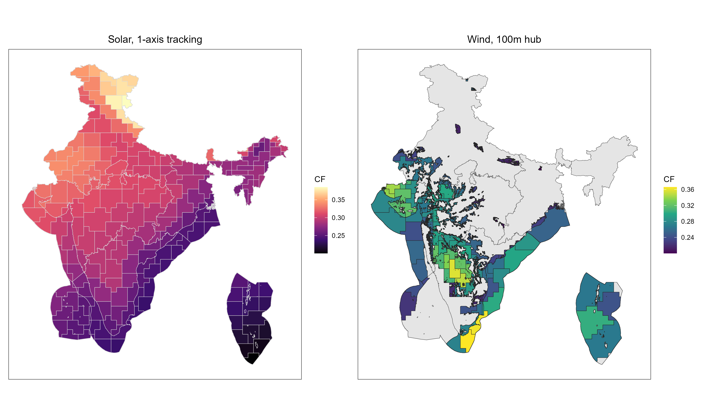
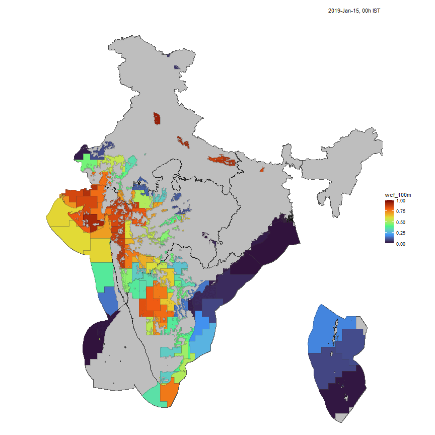
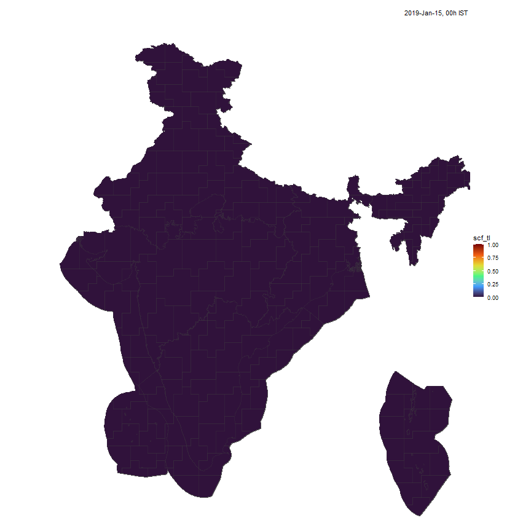
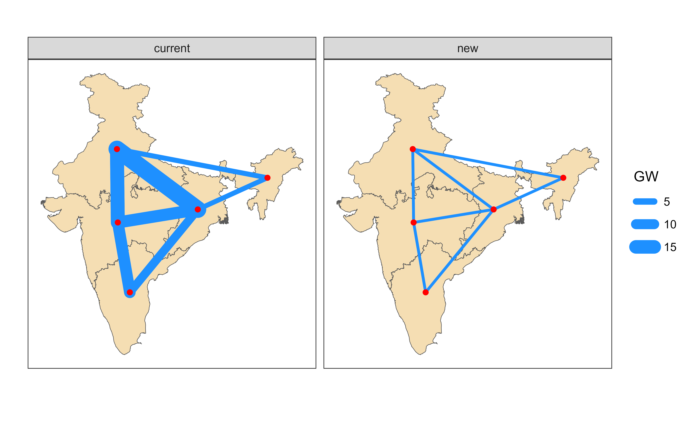
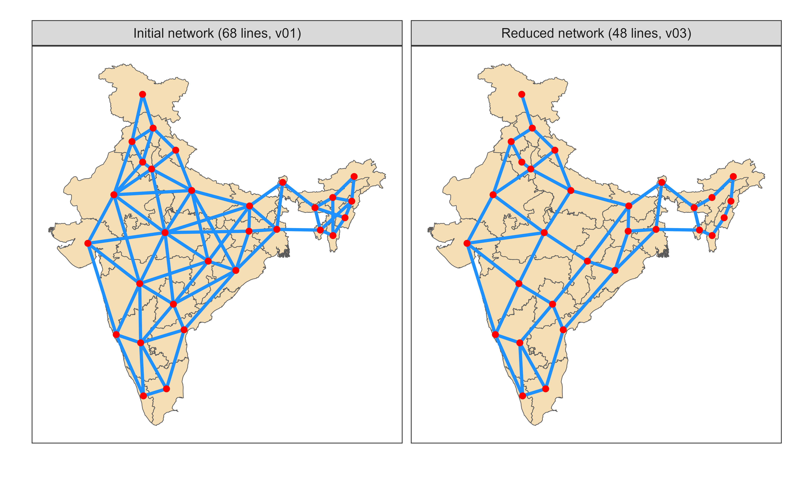

## Indian Zero Carbon Energy Pathways (IDEEA) 

<!--
==============================================================================
Notes:
This document drafts a presentation (in html, Power Point, or PDF format -
see "format" in the YAML - top of the screen).
Rendering may require Quarto (https://quarto.org/) installed on the system.
The presentation is created in two steps. First: generation of all figures,
and saving them to /images directory. Set `build: true` to recreate all figures.
Second step will use the pre-created figures to render the presentation.
Use: `build: false` to avoid creating figures and other inputs, using pre-built
files only.

==============================================================================
-->

-   Open source Energy System optimization model for India

-   Extensive representation of Electric Power Sector

-   Flexible spatial (1-5-32 regions) and temporal resolution

-   8760 hours/a year (default, flexible)

-   Various policy constraints (subsidies, taxes, emissions caps, etc..)

-   Inter-temporal optimization

-   Expandable to outer sectors (transport, buildings, cement, iron, steel, ...)

```{r setup, include=FALSE}
# Load packaged and data before rendering the presentation
knitr::opts_chunk$set(echo = FALSE) # Don't show code in the ppt (by default)
# (optional) reset of environment - will clean up all objects in memory
reset_env <- FALSE
if (exists(".scen")) rm(.scen)
if (reset_env) {
  source("R/reset.R")
  reset_session(warn = TRUE, prompt = FALSE)
}
source("R/setup.R")
source("R/functions.R")

# set a parameter with number of regions for easy switch in figures 
nreg <- 5
regN <- glue("reg", nreg); regN_off <- paste0(regN, "_off")

# set the range (or exact years) to report (the requested years must be in scenarios)
report_years = c(2025:2150)

# focus_region <- "MH" # reserved for state-level model(s) to show on figures

ideea_sf <- get_ideea_map(nreg, offshore = T) |>
  mutate(region = reg5_off, .before = 1)

# load scenarios: comment/uncomment lines with scenario-names 
scen_to_load <- c(
  # full year
  "REF3_IDEEA_ELC_reg5_d365_h24_Y2020_2070_by_15",
  "CAP3_IDEEA_ELC_reg5_d365_h24_Y2020_2070_by_15"
  # subset (1 day per month == 288 hours)
  # "REF3_sub_IDEEA_ELC_reg5_d365_h24_subset_1day_per_month_Y2070",
  # "CAP3_sub_IDEEA_ELC_reg5_d365_h24_subset_1day_per_month_Y2070"
)

for (s in scen_to_load) {
  load_scenario(file.path(ideea_scenarios(), s), overwrite = TRUE)
}


ls(envir = .scen)

# combine them in a named list for comparison
sns <- list(
  REF = .scen$REF3,
  CAP = .scen$CAP3
  # REF_sub = .scen$REF3_sub,
  # CAP_sub = .scen$CAP3_sub
)
# sns_sub <- list(
#   REF_sub = .scen$REF3_sub,
#   CAP_sub = .scen$CAP3_sub  
# )

obj_test <- getData(sns, "vObjective", merge = T)
if (nrow(obj_test) != length(sns)) {
  stop("Cannot access the data in scenarios - check/update path")
  # most likely the path was not updated - see readme.rmd
} else {
  obj_test
}

```

<!-- ======================== Slides start here =========================== -->

## Scenarios

-   **REF** - reference scenario, all technologies, no policy.

-   **CAP** - Carbon neutrality by 2070, linear decline.

**Carbon reduction options:**

-   Solar, Wind (onshore and offshore), CCUS, biomass.

**Balancing options:**

-   energy storage (batteries), transmission, demand-side management.

# Data / Model inputs

-   Final demand level and profiles (load curve) by year

-   The current state of the power sector (existing generating capacity, transmission)

-   New technological options (thermal, renewables, batteries, etc.)

-   Hourly profiles for renewables by location (MERRA2 40 years, NREL, GridLab, ...)

-   Export/Import (energy carriers, electricity)

-   Policy and other constraint (by scenario)

## Electricity demand assumptions

<!-- 
Note: use `include=TRUE` or `include=FALSE` to show or mute the output of a chunk -->

```{r, include=FALSE}
# demand is the same across scenarios, load one (REF)
pDemand <- getData(sns$REF, "pDemand", merge = T, process = T
                   # year = report_years
                   ) |>
  filter(year %in% report_years) |>
  mutate(
    datetime = tsl2dtm(slice, tmz = "Asia/Kolkata", year = 2019), # @Varun: Confirm the year since it affects weekdays
    DATE = as.Date(datetime),
    HOUR = tsl2hour(slice),
    YDAY = tsl2yday(slice),
    MONTH = tsl2month(slice) |> factor(levels = 1:12, ordered = TRUE),
    MONTH_abb = month.abb[MONTH] |> factor(levels = month.abb, ordered = TRUE),
    SEASON = case_when(
      MONTH %in% c(12, 1, 2) ~ "Winter",
      MONTH %in% (3:5) ~ "Spring",
      MONTH %in% (6:8) ~ "Summer",
      MONTH %in% (9:11) ~ "Autumn"
    ) |> 
      factor(ordered = TRUE, 
             levels = c("Spring", "Summer", "Autumn", "Winter")),
    QUARTER = case_when(
      MONTH %in% (4:6) ~ "Q1",
      MONTH %in% (6:8) ~ "Q2",
      MONTH %in% (9:12) ~ "Q3",
      MONTH %in% (1:3) ~ "Q4"
    ),
    WEEKDAY = format(datetime, "%a") |>
      factor(ordered = TRUE,
             levels = format(as.Date("1970-01-04") + 0:6, "%a"))
  ) |>
  as.data.table()

# plot total demand by type
pDemand |> 
  rename(PROCESS = process, YEAR = year) |>
  mutate(YEAR = as.factor(YEAR)) |>
  group_by(scenario, PROCESS, comm, YEAR) |>
  summarise(GWh = sum(value), .groups = "drop") |>
  ggplot() +
  geom_col(aes(YEAR, GWh/1e3, fill = PROCESS)) +
  scale_fill_viridis_d(name = "", direction = -1, option = "D") +
  labs(x = "", y = "TWh") +
  theme_bw()

```

```{r, include=TRUE}
pDemand |> 
  rename(PROCESS = process, YEAR = year) |>
  mutate(YEAR = as.factor(YEAR)) |>
  group_by(scenario, comm, YEAR) |>
  summarise(GWh = sum(value), .groups = "drop") |>
  ggplot() +
  geom_col(aes(YEAR, GWh/1e3), fill = "dodgerblue") +
  scale_fill_viridis_d(name = "", direction = -1, option = "D") +
  labs(x = "", y = "TWh") +
  theme_bw()

```

## Load curve

```{r load-curve}
pDemand |>
  filter(year == 2025, process == "DEMELC_BY") |>
  ggplot() +
  geom_line(aes(HOUR, value, colour = MONTH_abb, group = YDAY), 
            # linewidth = .5, 
            alpha = .75) +
  # scale_colour_brewer(palette = "Paired", name = "Month") +
  scale_colour_viridis_d(option = "H", alpha = .75, name = "Month") +
  # scale_colour_viridis_d(option = "H", alpha = .75, limits = c(0, 12),
                         # name = "Month") +
  facet_wrap(~region, scales = "free_y") +
  labs(x = "Hour of Day", y = "GWh") +
  theme_bw() +
  guides(colour = guide_legend(override.aes = list(linewidth = 1.5)))

```

## Load by month (average)

```{r}
pDemand |>
  filter(year == 2025, process == "DEMELC_BY") |>
  group_by(comm, region, year, MONTH_abb, HOUR) |>
  summarise(value = mean(value, na.rm = T), .groups = "drop") |>
  ggplot() +
  geom_line(aes(HOUR, value, colour = MONTH_abb, group = MONTH_abb),
            linewidth = 1) +
  # scale_colour_viridis_d(option = "H", alpha = .75, name = "Month") +
  scale_colour_viridis_d(option = "H", alpha = 1, name = "Month") +
  # scale_colour_brewer(palette = "Set1", name = "Month") +
  # scale_colour_brewer(palette = "Paired", name = "Month") +
  facet_wrap(~region, scales = "free_y") +
  labs(x = "Hour of Day", y = "GWh") +
  theme_bw() +
  guides(colour = guide_legend(override.aes = list(linewidth = 1.5)))
```

## Load by season

```{r}
pDemand |>
  filter(year == 2025, process == "DEMELC_BY") |>
  group_by(comm, region, year, SEASON, HOUR) |>
  summarise(value = mean(value, na.rm = T), .groups = "drop") |>
  ggplot() +
  geom_line(aes(HOUR, value, colour = SEASON, group = SEASON),
            linewidth = 1) +
  scale_colour_viridis_d(option = "D", alpha = 1, name = "Season", 
                         direction = -1) +
  # scale_colour_viridis_d(option = "D", alpha = 1, name = "Month") +
  # scale_colour_brewer(palette = "Paired", name = "Month") +
  # scale_colour_brewer(palette = "Paired", name = "Month") +
  facet_wrap(~region, scales = "free_y") +
  labs(x = "Hour of Day", y = "GWh") +
  theme_bw()+
  guides(colour = guide_legend(override.aes = list(linewidth = 1.5)))
```

## Load by quarter

```{r, include=TRUE}
pDemand |>
  filter(year == 2025, process == "DEMELC_BY") |>
  group_by(comm, region, year, QUARTER, HOUR) |>
  summarise(value = mean(value, na.rm = T), .groups = "drop") |>
  ggplot() +
  geom_line(aes(HOUR, value, colour = QUARTER, group = QUARTER),
            linewidth = 1) +
  scale_colour_viridis_d(option = "D", alpha = 1, name = "Quater", 
                         direction = -1) +
  # scale_colour_viridis_d(option = "D", alpha = 1, name = "Month") +
  # scale_colour_brewer(palette = "Paired", name = "Month") +
  # scale_colour_brewer(palette = "Paired", name = "Month") +
  facet_wrap(~region, scales = "free_y") +
  labs(x = "Hour of Day", y = "GWh") +
  theme_bw() +
  guides(colour = guide_legend(override.aes = list(linewidth = 1.5)))
```

## Load by Weekday

```{r}
pDemand |>
  filter(year == 2025, process == "DEMELC_BY") |>
  group_by(comm, region, year, WEEKDAY, HOUR) |>
  summarise(value = mean(value, na.rm = T), .groups = "drop") |>
  ggplot() +
  geom_line(aes(HOUR, value, colour = WEEKDAY, group = WEEKDAY),
            linewidth = 1) +
  scale_colour_viridis_d(option = "D", alpha = 1, name = "Weekday", 
                         direction = 1) +
  # scale_colour_viridis_d(option = "D", alpha = 1, name = "Month") +
  # scale_colour_brewer(palette = "Paired", name = "Month") +
  # scale_colour_brewer(palette = "Paired", name = "Month") +
  facet_wrap(~region, scales = "free_y") +
  labs(x = "Hour of Day", y = "GWh") +
  theme_bw() +
  guides(colour = guide_legend(override.aes = list(linewidth = 1.5)))
```

## National Load by Weekday and Season

```{r}
pDemand |>
  filter(year == 2025, process == "DEMELC_BY") |>
  group_by(comm, year, SEASON, WEEKDAY, HOUR) |>
  summarise(value = mean(value, na.rm = T), .groups = "drop") |>
  ggplot() +
  geom_line(aes(HOUR, value, colour = WEEKDAY, group = WEEKDAY),
            linewidth = 1) +
  scale_colour_viridis_d(option = "D", alpha = 1, name = "Weekday", 
                         direction = 1) +
  # scale_colour_viridis_d(option = "D", alpha = 1, name = "Month") +
  # scale_colour_brewer(palette = "Paired", name = "Month") +
  # scale_colour_brewer(palette = "Paired", name = "Month") +
  facet_wrap(~SEASON, scales = "free_y") +
  labs(x = "Hour of Day", y = "GWh") +
  theme_bw() +
  guides(colour = guide_legend(override.aes = list(linewidth = 1.5)))
```

## Load profile (heatmap)

```{r}
pDemand |>
  filter(year == 2025) |>
  group_by(scenario, comm, year, datetime, DATE, HOUR, YDAY) |>
  summarise(value = sum(value, na.rm = T), .groups = "drop") |>
  as.data.table() |>
  ggplot() +
  geom_tile(aes(DATE, HOUR, fill = value)) +
  scale_fill_viridis_c(option = "H", name = "GWh") +
  scale_x_date(expand = c(0, 0)) +
  scale_y_continuous(expand = c(0, 0), breaks = seq(0, 24, by = 4)) +  
  # facet_wrap(~scenario, scales = "free_y") +
  # facet_wrap(~region, scales = "free") +
  labs(x = "", y = "Hour of Day") +
  theme_bw()
```

## Load curve in MH by month

```{r}
# get demand data from IDEEA internal database
elc_MH <- ideea_data$load_2019_MWh |>
  filter(reg36 %in% "MH") |>
  group_by(reg36, MONTH, HOUR) |>
  summarise(
    MWh = sum(MWh / length(unique(YDAY)), na.rm = T),
    .groups = "drop"
  ) |>
  mutate(
    MONTH_abb = month.abb[MONTH] |> factor(levels = month.abb, ordered = TRUE)
  )

ggplot(elc_MH) +
  geom_line(aes(HOUR, MWh/1e3, colour = MONTH_abb, group = MONTH), 
            linewidth = 1.5) +
  scale_colour_viridis_d(option = "H", 
                         # alpha = .75, limits = c(0, 12),
                         name = "Month") +
  # scale_colour_distiller(palette = "Spectral", limits = c(0, 12), name = "Month") +
  labs(x = "Hour of Day", y = "Daily average load curve, GWh") +
  theme_bw() +
  guides(colour = guide_legend(override.aes = list(linewidth = 1.5)))

```

## Load profile (heatmap) in MH

```{r}
ideea_data$load_2019_MWh |>
  filter(reg36 %in% "MH") |>
  mutate(DATE = as.Date(datetime)) |>
  ggplot() +
  geom_tile(aes(DATE, HOUR, fill = MWh / 1e3)) +
  scale_fill_viridis_c(option = "H", name = "GWh") +
  scale_x_date(expand = c(0, 0)) +
  scale_y_continuous(expand = c(0, 0), breaks = seq(0, 24, by = 4)) +  
  # facet_wrap(~scenario, scales = "free_y") +
  # facet_wrap(~region, scales = "free") +
  labs(x = "", y = "Hour of Day") +
  theme_bw()

```

## Clustered locations of renewables by potential



## Hourly capacity factors by locations (clustered)

::::: columns
::: {.column width="50%"}

:::

::: {.column width="50%"}

:::
:::::

<!-- ## Capacity factors - v2 -->

<!-- ::: {style="display: flex; justify-content: space-between;"} -->

<!--   -->

<!-- ::: -->

# Results preview

## Model output: CO2 emissions, Mt

```{r}
# all emissions from fuel combustion
vEmsFuelTot_CO2 <- getData(sns, name = "vEmsFuelTot", comm = "CO2", 
                           merge = T, digits = 1, drop.zeros = F)
# display as table
table_data <- vEmsFuelTot_CO2 |> 
  group_by(scenario, year) |>
  summarise(
    value = sum(value, na.rm = TRUE)/1e3,
    .groups = "drop"
  ) |>
  pivot_wider(names_from = scenario, values_from = value) 
  

kableExtra::kable(head(table_data, 6), digits = 0)

```

## CO2 emission trends by scenario, Mt

```{r}
vEmsFuelTot_CO2 |>
  # aggregate:
  group_by(scenario, year) |> 
  summarise(value = sum(value, na.rm = TRUE), .groups = "drop") |>
  # plot
  ggplot() +
  geom_line(aes(year, value/1e3, color = scenario), linewidth = 2) +
  geom_point(aes(year, value/1e3, color = scenario), size = 3) +
  # facet_grid(~region) + # by region, w/o aggregation
  labs(x = "", y = "Mt") +
  theme_bw()

```

## Criteria pollutants (PM, SO2, NOx)

```{r}
conv_emis <- getData(sns, "vBalance", comm_ = "SOx|SO2|NOX|PM", merge = T) |>
  group_by(scenario, comm, year) |>
  summarise(value = sum(value), .groups = "drop") |>
  filter(year >= 2025) |>
  pivot_wider(names_from = comm)  |>
  arrange(scenario, year) |>
  group_by(scenario) |>
  mutate(
    NOX = NOX / NOX[1],
    SOX = SOX / SOX[1],
    PM = PM / PM[1]
  ) 
  # pivot_longer(cols = c(NOX, PM, SOX), names_to = "comm") |>
  # filter

ggplot(conv_emis) +
  geom_line(aes((year), 100 * PM), colour = "grey25", linewidth = 2) +
  geom_point(aes((year), 100 * PM), colour = "grey25", size = 3) +
  facet_grid(~scenario) +
  labs(x = "", y = "PM emissions index, 2025 = 100") +
  theme_bw()

```

## Total capacity

```{r}
# adjust capacity of 1-hour storage:
adj_storage_cap <- 4 # hours of storage per unit of capacity
vTechCap_ELC <- getData(sns, name = "vTechCap", merge = T, 
                           digits = 1, drop.zeros = T, process = T) |>
  # data pre-processing for figures:
  drop_process_cluster() |> drop_process_vintage() |>
  filter(!(process %in% c("EDC2ELC", "ELC2EDC"))) |> # drop converter stations
  filter(!grepl("^ALIAS", process)) |> # drop process aliases
  filter(year != 2020) |>
  mutate(scenario = factor(scenario, levels = c("REF", "CAP"), ordered = T)) |>
  group_by(scenario, process, year) |>
  summarise(value = sum(value), .groups = "drop")

vStorageCap_4h <- getData(sns, "vStorageCap", process = T, 
                       merge = T, digits = 2, drop.zeros = T) |>
  drop_process_vintage() |>
  group_by(scenario, process, year) |>
  summarise(
    value = sum(value) / adj_storage_cap, 
    .groups = "drop"
  ) 

# combined techs and storage
vCap_ELC <- bind_rows(vTechCap_ELC, vStorageCap_4h) |>
  add_process_label() |>
  group_by(scenario, process_label, year) |>
  summarise(value = sum(value, na.rm = T), .groups = "drop")

ggplot(vCap_ELC) +
  geom_bar(aes(as.factor(year), value, fill = process_label), 
           stat = "identity") +
  facet_wrap(~scenario) +
  scale_fill_viridis_d(option = "H", direction = -1, name = "Technology") +
  # facet_grid(~region) +
  labs(x = "", y = "GW") +
  theme_bw()
```

## Capacity in 2070, GW

```{r}
# Add table
vCap_ELC |> 
  filter(year %in% c(2070)) |>
  pivot_wider(names_from = scenario) |>
  kableExtra::kable(digits = 1)
```

## New installations, GW

```{r}
vTechNewCap_ELC_agg <- getData(sns, name = "vTechNewCap", merge = T, 
                           digits = 1, drop.zeros = T, process = T) |>
  # data pre-processing for figures:
  drop_process_cluster() |> drop_process_vintage() |>
  filter(!(process %in% c("EDC2ELC", "ELC2EDC"))) |> # drop converter stations
  filter(!grepl("^ALIAS", process)) |> # drop process aliases
  # filter(year != 2020) |>
  mutate(year = if_else(year == 2020, 2025, year)) |> # aggregate 2020 and 2025
  # mutate(scenario = factor(scenario, levels = c("REF", "CAP"), ordered = T)) |>
  group_by(scenario, process, year) |>
  summarise(value = sum(value), .groups = "drop") |>
  add_process_label()

ggplot(vTechNewCap_ELC_agg) +
  geom_col(aes(as.factor(year), value, fill = process_label)) +
  facet_wrap(~scenario) +
  scale_fill_viridis_d(option = "H", direction = 1, name = "Technology") +
  # facet_grid(~region) +
  labs(x = "", y = "GW") +
  # facet_grid(~region)
  theme_bw()

```

## Solar installatons 2025-2070 by region, GW

```{r}
vTechNewCap_ELC <- getData(sns, name = "vTechNewCap", merge = T, 
                           digits = 1, drop.zeros = T, process = T) |>
  filter(year %in% report_years) |>
  drop_process_cluster() |> drop_process_vintage() |>
  filter(!(process %in% c("EDC2ELC", "ELC2EDC"))) |> # drop converter stations
  filter(!grepl("^ALIAS", process)) |> # drop process aliases
  # mutate(year = if_else(year == 2020, 2025, year)) |> # aggregate 2020 and 2025
  mutate(scenario = factor(scenario, levels = c("REF", "CAP"), ordered = T)) |>
  group_by(scenario, region, process) |>
  summarise(value = sum(value), .groups = "drop")

ideea_ncap_sf <- ideea_sf |> 
  right_join(vTechNewCap_ELC, relationship = "many-to-many", by = "region")

# New Solar capacity
ggplot() +
  geom_sf(data = ideea_sf) +
  geom_sf(aes(fill = value), 
          data = filter(ideea_ncap_sf, grepl("SOL", process))) +
  scale_fill_viridis_c(option = "H", name = "GW", transform = "log10") +
  facet_wrap(~scenario) +
  theme_ideea_map()

```

## Wind installatons 2025-2070, GW

```{r}
# New Solar capacity
ggplot() +
  geom_sf(data = ideea_sf) +
  geom_sf(aes(fill = value), 
          data = filter(ideea_ncap_sf, grepl("WIN", process))) +
  scale_fill_viridis_c(option = "H", name = "GW", transform = "log10") +
  facet_wrap(~scenario) +
  theme_ideea_map()

```

## Thermal installatons 2025-2070, GW

```{r}
# New Solar capacity
ggplot() +
  geom_sf(data = ideea_sf) +
  geom_sf(aes(fill = value), 
          data = filter(ideea_ncap_sf, !grepl("SOL|WIN", process))) +
  scale_fill_viridis_c(option = "H", name = "GW", transform = "log10") +
  facet_grid(scenario~process) +
  theme_ideea_map()

```

## Generation profile: REF scenario

```{r}
all_slices <- sns$CAP@settings@calendar@timetable$slice

# (very) quick plots to use
# ?ideea_snapshot
ideea_snapshot2(sns$REF, YEAR = 2070, SLICE = all_slices[1:24])

```

## Generation profile: CAP scenario

```{r}
ideea_snapshot2(sns$CAP, YEAR = 2070, SLICE = all_slices[1:24])

```

## Solar installations by cluster and year

```{r}
add_cluster_column <- function(x, col_name = "process") {
  x |> mutate(
    cluster = as.integer(str_extract(get(col_name), "[0-9]+$")),
    .after = col_name
  )
}

ideea_sol_cl_sf <- get_ideea_cl_sf("sol", nreg = nreg, tol = .05) 

vTechCap <- getData(sns,
  name = "vTechCap", tech_ = "^E", process = T,
  merge = T, digits = 3, drop.zeros = T
)

vTechCap_ESOL_sf <-
  vTechCap |>
  filter(year %in% report_years) |>
  filter(grepl("ESOL", process)) |> # select solar techs
  add_cluster_column() |> # add cluster number
  # add shapes for every cluster
  left_join(ideea_sol_cl_sf,
    by = c(region = regN_off, cluster = "cluster"),
    relationship = "many-to-many"
  ) |>
  rename(GW = value) |>
  filter(!is.na(GW), GW > 0) |>
  # filter(year %in% c(2025, 2035, 2060)) |>
  st_as_sf() # force to treat 'geometry' column as shape-data

ggplot() +
  geom_sf(data = ideea_sf) +
  geom_sf(aes(fill = GW), data = vTechCap_ESOL_sf, color = NA, na.rm = T) +
  # scale_fill_viridis_c(option = "H") +
  scale_fill_viridis_c(option = "C") +
  facet_grid(scenario~year) +
  theme_ideea_map()


```

## Wind installations by cluster and year

```{r}
ideea_win_cl_sf <- get_ideea_cl_sf("win", nreg = nreg, tol = .1) 
vTechCap_EWIN_sf <-
  vTechCap |>
  filter(year %in% report_years) |>  
  filter(grepl("EWIN", process)) |> # select solar techs
  add_cluster_column() |> # add cluster number
  # add shapes for every cluster
  left_join(ideea_win_cl_sf,
    by = c(region = regN_off, cluster = "cluster"),
    relationship = "many-to-many"
  ) |>
  rename(GW = value) |>
  filter(!is.na(GW), GW > 0) |>
  # filter(year %in% c(2025, 2035, 2060)) |>
  st_as_sf() # force to treat 'geometry' column as shape-data

ggplot() +
  geom_sf(data = ideea_sf) +
  geom_sf(aes(fill = GW), data = vTechCap_EWIN_sf, color = NA, na.rm = T) +
  scale_fill_viridis_c(option = "D") +
  # scale_fill_viridis_c(option = "D", transform = "log10") +
  facet_grid(scenario~year) +
  theme_ideea_map()

```

## Storage energy capacity, GWh

```{r}
pivot_wider(vStorageCap_4h, names_from = scenario) |> 
  kableExtra::kable(digits = 1)

```

## Transmission (5 regions)

AC and DC transmission options, existing and new.



## Transmission (32 regions)

Transmission expansion options in 32-region model.



```{r, include=FALSE}
vTradeCap <- getData(sns, "vTradeCap", digits = 1, 
                     drop.zeros = T, merge = T)
vTradeNewCap <- getData(sns, "vTradeNewCap", digits = 1, 
                        drop.zeros = T, 
                        merge = T)
# Not installing in the 5-reg scenario ???
# Further considerations:
# - validate costs of transmission expansion for both DC and AC
# - validate pre-existing capacity (pTradeStock) - might be too high.
# getData(sns, c("pTradeStock", "vTradeCap"), process = T, merge = T, digits = 1, year = 2070) |> pivot_wider(names_from = name) |> as.data.table()

# Converter stations for DC lines:
dc_converters <- getData(sns, c("vTechNewCap", "pTechStock"), tech_ = "EDC",
                         process = T, merge = T, digits = 1) 
dc_converters |> group_by(scenario, process, region) |> 
  summarise(value = sum(value), .groups = "drop") |> 
  pivot_wider(names_from = scenario)

dc_converters |> group_by(scenario, process, region) |> 
  summarise(value = sum(value), .groups = "drop") |> 
  pivot_wider(names_from = scenario)

dc_converters |> group_by(scenario, process, region) |> 
  summarise(value = sum(value), .groups = "drop") |> 
  pivot_wider(names_from = c(scenario, process)) |>
  kableExtra::kable()

```

## Electricity trade in 2050, GWh

```{r}
vTradeIr <- getData(sns, "vTradeIr", digits = 1, drop.zeros = T, 
                    merge = T,
                    process = T)

vTradeIr |>
  group_by(scenario, src, dst, year) |>
  summarise(value = sum(value)) |>
  filter(year == 2050) |> select(-year) |>
  pivot_wider(names_from = scenario) |>
  rename(From = src, To = dst) |>
  kableExtra::kable(format.args = list(big.mark = ','), digits = 0)

```

<!-- ## Unserved load (curtailed demand) -->

```{r, include=FALSE}
vImportRow <- getData(sns, "vImportRow", comm = "ELC", 
                      merge = T, digits = 1) 

# vImportRow$value |> summary()
# vImportRow$imp |> unique()
vImportRow |>
  filter(year %in% report_years) |>
  ggplot() +
  geom_col(aes(as.factor(year), value/1e3, fill = region)) +
  labs(x = "", y = "TWh") +
  facet_grid(imp~scenario) +
  theme_bw()

```

## Curtailed generation (oversupply)

```{r}
vExportRow <- getData(sns, "vExportRow", comm = "ELC", 
                      merge = T, digits = 1) 

# vExportRow$value |> summary()
# vImportRow$imp |> unique()
vExportRow |>
  filter(year %in% report_years) |>
  ggplot() +
  geom_col(aes(as.factor(year), value/1e3, fill = region)) +
  labs(x = "", y = "TWh") +
  facet_grid(expp~scenario) +
  theme_bw()

```

## Curtailed generation in 2070 (heatmap)

```{r}
vExportRow |>
  filter(year == 2070) |>
  mutate(
    datetime = tsl2dtm(slice, tmz = "Asia/Kolkata", year = year),
    DATE = as.Date(datetime),
    HOUR = tsl2hour(slice),
    YDAY = tsl2yday(slice),
    MONTH = tsl2month(slice)
  ) |>
  group_by(scenario, comm, year, datetime, DATE, HOUR, YDAY) |>
  summarise(value = sum(value, na.rm = T), .groups = "drop") |>
  as.data.table() |>
  ggplot() +
  geom_tile(aes(DATE, HOUR, fill = value)) +
  scale_fill_viridis_c(option = "H", name = "GWh") +
  scale_x_date(expand = c(0, 0)) +
  scale_y_continuous(expand = c(0, 0), breaks = seq(0, 24, by = 4)) +  
  facet_wrap(~scenario, scales = "free_y") +
  # facet_wrap(~region, scales = "free") +
  labs(x = "", y = "Hour of Day") +
  theme_bw()
```

## Levelized Costs of Electricity (LCOE)

```{r}
# Total system costs
vTotalCost <- getData(sns, name = "vTotalCost", merge = T)

# all_costs <- getData(sns, name_ = "cost|eac|fixom|varom", merge = T, process = T)
# all_costs |> as.data.table()

# all generated electricity (generators, no storage, no transmission)
vTechOut_ELC <- getData(sns, name = "vTechOut", merge = T, digits = 3,
                        comm = "ELC", drop.zeros = T) 

vTechOut_ELC_ry <- vTechOut_ELC |>
  group_by(scenario, name, region, year) |>
  summarise(value = sum(value), .groups = "drop")

# Curtailed (unconsumed) elecrticity
vBalance_ELC <- getData(sns, "vBalance", comm = "ELC", merge = T, digits = 3,
                        drop.zeros = T) |>
  group_by(scenario, name, region, year) |>
  summarize(value = sum(value), .groups = "drop")

pDemand_ELC_ry <- getData(sns, name_ = "pDemand", merge = T) |>
  group_by(scenario, name, region, year) |>
  summarize(value = sum(value), .groups = "drop")

elc_cost <- full_join(vTotalCost, vTechOut_ELC_ry, 
                      by = c("scenario", "name", "region", "year", "value")) |>
  full_join(vBalance_ELC) |>
  full_join(pDemand_ELC_ry) |>
  # summarize for national level
  group_by(scenario, name, year) |>
  summarize(value = sum(value), .groups = "drop") |>
  # variable names to columns
  pivot_wider(names_from = name) |>
  # calculate costs
  mutate(
    scenario = factor(scenario, levels = c("REF", "CAP"), ordered = T),
    ELC_cost = vTotalCost / pDemand
  ) 

ggplot(filter(elc_cost, year >= 2025)) +
  geom_bar(aes(factor(year), 
               convert("cr.INR/GWh", "INR/kWh", ELC_cost)),
               # convert("cr.INR/GWh", "USD/MWh", ELC_cost)), 
           fill = "dodgerblue", stat = "identity") +
  facet_grid(~scenario) +
  labs(x = "", y = "₹ / kWh") +
  theme_bw()

```

## Costs structure

```{r}
all_costs <- getData(sns, name_ = "cost|eac|fixom|varom", merge = T, 
                     process = T, digits = 1, drop.zeros = T, 
                     parameters = F) |> 
  filter(!grepl("vTotalCost|vTradeCost|vTradeIrCost", name)) |>
  # drop_process_cluster() |>
  # drop_process_vintage() |>
  add_costs_label() |>
  # group_by(scenario, name, process, region, year) |>
  group_by(scenario, name, costs_label, year) |>
  summarise(value = sum(value, na.rm = T), .groups = "drop") |>
  as.data.table()

ggplot(filter(all_costs, year %in% report_years)) +
  geom_col(aes(factor(year), value, fill = costs_label)) +
  facet_grid(~scenario) +
  labs(x = "", y = "cr. ₹") +
  scale_fill_viridis_d(option = "H", name = "Cost type") +
  theme_bw()


```

## IDEEA extensions

IDEEA is a Marco Energy System model with flexible technological options. Sectors in progress:

-   Iron & Steel, buildings, transportation, construction materials, refineries, energy trade, ...

Particular focus:

-   Electrification, Hydrogen, Demand-side management, emissions control

# Thank you for your attention!

Contacts: ...

# Extra slides

```{=html}
<!-- 
=========== Add supplementary slides below this comment =======================
-->
```
